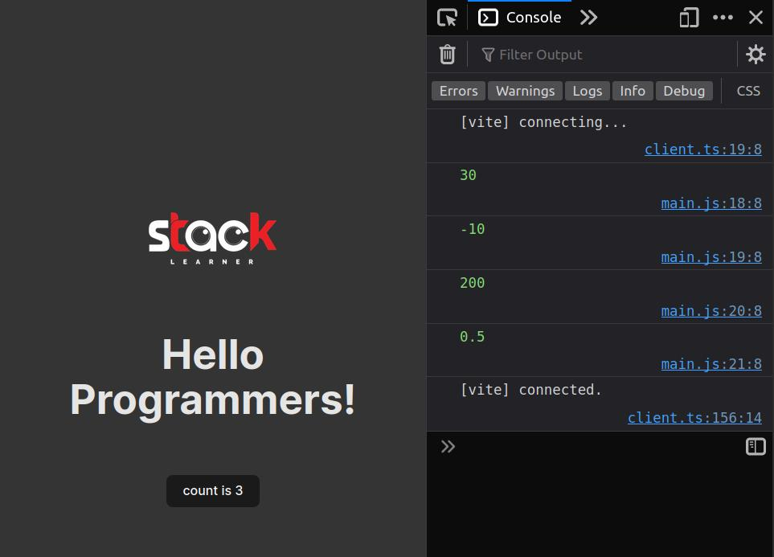

# ES6 Setup Template

## Project Template Preview

## How to use

[Note:  You need to have Node.js installed on your machine. Use `yarn` or `npm` to run the commands. Not both. I prefer `yarn`. But you can use `npm` if you want.]

1. Clone this repo `git clone https://github.com/mdmarufsarker/es6-project-template.git`
2. Run `npm install` or `yarn install`
3. Run `npm run dev` or `yarn dev` to start the development server
4. Run `npm run build` or `yarn build` to build the project for production

## Features

- [x] ES6 to ES5
- [x] SCSS to CSS

## License

[MIT](https://github.com/mdmarufsarker/es6-project-template/blob/main/LICENSE)

## Author

[Maruf Sarker](https://www.youtube.com/@maruf_sarker)

## Notes

Here I used [bun.sh](https://github.com/oven-sh/bun) to install packages. You can use [yarn](https://yarnpkg.com/) or [npm](https://www.npmjs.com/). In this case, you have to delete `bun.lock` file to avoid conflict. Also rewrite `type: module` to `type: commonjs` in `package.json` file.
