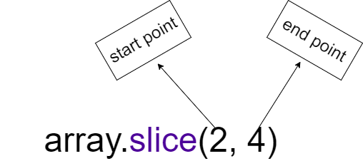
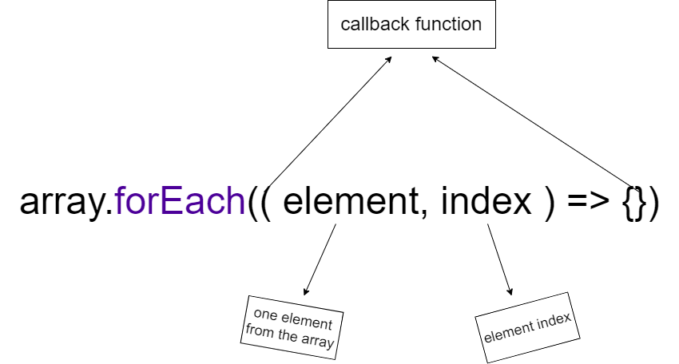

# Array

Let's assume that I have a crush 🐱. Now I can easily store her into my memory.

```js
let crushMemory = ["sadia"];
```

But what if I have more than one crush? Do I need to create a lot of variables? Something like this?

```js
let crushMemory1 = ["sadia"];
let crushMemory2 = ["sumaiya"];
let crushMemory3 = ["sabrina"];
```

What if I have 100 crushes? Do I need to create 100 variables?

The answer is **NO**. I can easily store all of my crushes into a single variable. And that variable is called **Array**.

```js
let crushMemory = ["sadia", "sumaiya", "sabrina"];
```

Now I can easily access any of my crushes by using their index number. Normally we count from 1. But in programming we count from 0. So the index number of the first crush is 0, the index number of the second crush is 1 and the index number of the third crush is 2.

```js
let crushMemory = ["sadia", "sumaiya", "sabrina"];
console.log(crushMemory[0]); // sadia
console.log(crushMemory[1]); // sumaiya
console.log(crushMemory[2]); // sabrina
```

According to wikipedia, an array is a data structure consisting of a collection of elements (values or variables), each identified by at least one array index or key. An array is stored so that the position of each element can be computed from its index by a mathematical formula.

Here I have created an array of 3 elements and those elements are "sadia", "sumaiya" and "sabrina". All of those elements are names of my crushes. Now the question arises that `keya yea jamane me mene bas 3 crushes ka nam yad rakhtahu? or ya fer un 3 oka nam, favorite color, birthday, havit, favorite food etc yad rakhtahu. So, how can I store all of those information?`

Up to this point, we learned that we can store multiple values into a single variable by using an array. It's called 1D array. 1D means 1 dimensional. It's like a line. But what if we want to store multiple values into a single variable in a 2D way? It's like a table. We can do that by using a 2D array. Let's see how we can do that.

```js
let crushMemory = [
  ["sadia", "sumaiya", "sabrina"],
  ["red", "blue", "green"],
  ["1st January", "2nd February", "3rd March"],
  ["pizza", "burger", "hotdog"],
];
```

Let's visualize this 2D array in a table.

```md
| Name    | Favorite Color | Birthday     | Favorite Food |
| ------- | -------------- | ------------ | ------------- |
| sadia   | red            | 1st January  | pizza         |
| sumaiya | blue           | 2nd February | burger        |
| sabrina | green          | 3rd March    | hotdog        |
```

Now we can easily access any of the information by using the index number of the row and the column. Let's see how we can do that.

```js
let crushMemory = [
  ["sadia", "sumaiya", "sabrina"],
  ["red", "blue", "green"],
  ["1st January", "2nd February", "3rd March"],
  ["pizza", "burger", "hotdog"],
];

console.log(crushMemory[0][0]); // sadia
console.log(crushMemory[0][1]); // sumaiya
console.log(crushMemory[0][2]); // sabrina

console.log(crushMemory[1][0]); // red
console.log(crushMemory[1][1]); // blue
console.log(crushMemory[1][2]); // green

console.log(crushMemory[2][0]); // 1st January
console.log(crushMemory[2][1]); // 2nd February
console.log(crushMemory[2][2]); // 3rd March

console.log(crushMemory[3][0]); // pizza
console.log(crushMemory[3][1]); // burger
console.log(crushMemory[3][2]); // hotdog
```

Here we can see a variable with a lots of data. How can we use those data to make information? Let's see how we can do that.

```js
let crushMemory = [
  ["sadia", "sumaiya", "sabrina"],
  ["red", "blue", "green"],
  ["1st January", "2nd February", "3rd March"],
  ["pizza", "burger", "hotdog"],
];

console.log(
  crushMemory[0][0] +
    " loves " +
    " and her favorite color is " +
    crushMemory[1][0] +
    ". Her birthday is " +
    crushMemory[2][0] +
    "."
);
// sadia loves pizza and her favorite color is red. Her birthday is 1st January.
console.log(
  crushMemory[0][1] +
    " loves " +
    " and her favorite color is " +
    crushMemory[1][1] +
    ". Her birthday is " +
    crushMemory[2][1] +
    "."
);
// sumaiya loves burger and her favorite color is blue. Her birthday is 2nd February.
console.log(
  crushMemory[0][2] +
    " loves " +
    " and her favorite color is " +
    crushMemory[1][2] +
    ". Her birthday is " +
    crushMemory[2][2] +
    "."
);
// sabrina loves hotdog and her favorite color is green. Her birthday is 3rd March.
```

If you come up to this point than congratulations 🎉. You have learned how to use array to store multiple values into a single variable. You have also learned how to use 2D array to store multiple values into a single variable in a 2D way. And finally you have learned how to use those data to make information.

## Array Methods

We can do the operations of the array very easily by the number of methods that we get in the JavaScript array that the array gives us. The operations here are delete from the beginning, delete from the end, add to the beginning, add to the end, remove a specific element from the array, etc.

## Table Of Content

- [Push](###Push)
- [Pop](###Pop)
- [Unshift](###Unshift)
- [Shift](###shift)
- [Slice](###Slice)
- [ForEach](###ForEach)

### Push

Push will add the element to the end of our array. The push method gives us an array.

**Example:**

```js
// Suppose you have an array called names
const names = ["John", "Ann", "Bob", "Alice", "Mary"];

console.log(names); // "John", "Ann", "Bob", "Alice", "Mary"

// When you pass a value into it with names.push(need value), that value will be added to the end of your names array.
names.push("Peter");

console.log(names); // "John", "Ann", "Bob", "Alice", "Mary", "Peter"
```

### Pop

We can add elements to the end of the array using push but when we need to delete elements from the end of the array we can do it using the **pop** method. Pop gives us an array.

**Example:**

```js
// Suppose you have an array called names
const names = ["John", "Ann", "Bob", "Alice", "Mary"];

console.log(names); // "John", "Ann", "Bob", "Alice", "Mary"

// If you call the function names.pop(), it will delete the last element in your names array.
names.pop();

console.log(names); // "John", "Ann", "Bob", "Alice"
```

### Unshift

Unshift adds the element to the beginning of your array. Just as you can add elements to the end of an array with push, you can add elements to the beginning of an array with unshift.

**Example:**

```js
// Suppose you have an array called names
const names = ["John", "Ann"];

console.log(names); // "John", "Ann"

// When you pass a value into it by calling names.unshift(need value), that value will be added to the beginning of the names array.
names.unshift("unshift");

console.log(names); // "unshift", "John", "Ann"
```

### shift

Shift allows you to delete elements from the beginning of an array. Earlier we learned that elements can be deleted from the end of the array using pop and now elements can be deleted from the beginning of the array using this shift.

**Example:**

```js
// Suppose you have an array called names
const names = ["John", "Ann", "Rakul"];

console.log(names); // "John", "Ann", "Rakul"

// When names.shift() is called, one element will be deleted from the first of the names array
names.shift();

console.log(names); // "Ann", "Rakul"
```

### Slice

Slice provides us with arrays. Slice allows us to cut a specific number of elements from an array. The slice gives us two points: one is the start point and the other is the end point. The start point is the index number from which we will start cutting the element and the end point is the number index from which we will end. But in this case the main array is not changed.

</br>


</br>

**Example:**

```js
// Suppose you have an array called names
const names = ["Rahi", "Maruf", "Alamin", "Naim", "Sagor"];

console.log(names); // "Rahi","Maruf","Alamin","Naim","Sagor"

console.log(names.slice(2, 4)); // "Alamin", "Naim"
```

After we call array.slice() we have to tell it how many numbers to start at index and then how many numbers to slice up to index. For which I have given array.slArray(2, 4) in the example, it means that it will start traversing from index 2 of the array and traversing till index 4. You can see the output.

**But if we want, after calling array.slice(), if we pass the number of elements required to be cut into the function, then that number of elements will be cut from the array. In that case, the slice method will take as starting point the number we give in that function and will cut the element from the array accordingly. Below is an example:**

```js
// Suppose you have an array called names
const names = ["Rahi", "Maruf", "Alamin", "Naim", "Sagor"];

console.log(names); // "Rahi","Maruf","Alamin","Naim","Sagor"

console.log(names.slice(2)); // "Alamin","Naim","Sagor"
```

</br>

### ForEach

foreach is a function and it receives a callback function. foreach iterates through the array and returns us one element at a time, and in that we get - ( element, index ). Later with the help of these we can perform any operation.

</br>


</br>

**Example:**

```js
// Suppose you have an array called names
const names = ["Rahi", "Maruf", "Alamin", "Naim", "Sagor"];

names.forEach((name, index) => console.log(index, name));
// output

// 0 Rahi
// 1 Maruf
// 2 Alamin
// 3 Naim
// 4 Sagor
```
